    

     
     
     
    
    
    
    
    
    
     
    
     
     
    
    
     
     
     
    
    
    
    
    
    
    
    
    
    
    

    

<h4>📊 GitHub Stats</h4>

    

<!---
rettichlp/rettichlp is a ✨ special ✨ repository because its `README.md` (this file) appears on your GitHub profile.
You can click the Preview link to take a look at your changes.
--->
